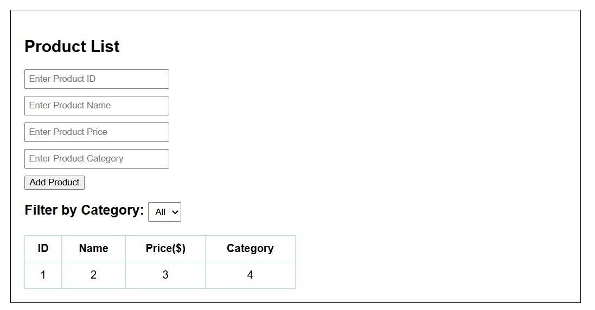
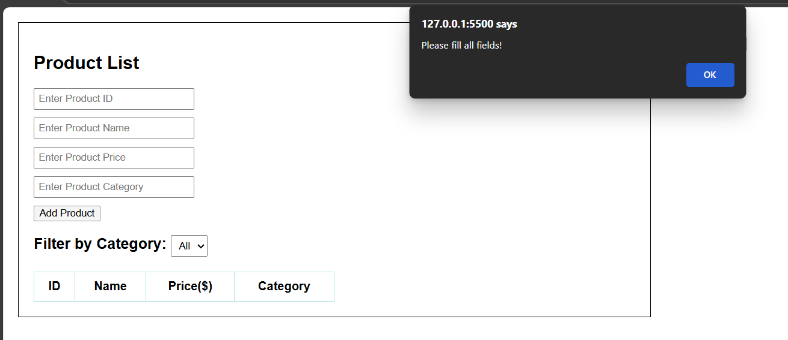

# 📝 Dynamic Product Filter with Dropdown using JavaScript DOM Manipulation

## 🎯 Objective

Build a web-based product list that can dynamically filter and display items based on the user's selection from a dropdown menu. This task helps you understand how to use JavaScript to manipulate the DOM, handle events, and update visible elements in real time.

## 📋 Task Description

Create a web page that displays a list of products (for example, shoes, shirts, or gadgets).  
Above the product list, include a dropdown menu with filter options such as **"All"**, **"Category 1"**, **"Category 2"**, etc.  

When the user selects an option from the dropdown, the product list should update immediately to show only the items that match the selected category.  

If **"All"** is selected, all products should be displayed.  

The filtering and display changes must happen **dynamically using JavaScript without reloading the page**.

### HTML5 [View Code](main.html)
```html
<!DOCTYPE html>
<html lang="en">
<head>
    <meta charset="UTF-8">
    <meta name="viewport" content="width=device-width, initial-scale=1.0">
    <script src="script.js"></script>
    <title>Product Lists</title>
</head>
<body>
    <h2>Product Input Fields</h2>
    <input type="number" id="productid" placeholder="Enter Product ID"><br>
    <input type="text" id="productname" placeholder="Enter Product Name"><br>
    <input type="number" id="productprice" placeholder="Enter Product Price"><br>
    <input type="text" id="productcategory" placeholder="Enter Product Category"><br>

    <input type="button" value="Add Product" onclick="addproductlist()"><br><br>

    <label for="categoryDropdown"><b>Filter By Category</b></label><br>
    <select id="categoryDropdown" onchange="filterbycategory()">
        <option value="all">--- All Categories ---</option>
    </select>
    <br><br>

    <table id="productTable">
        <thead>
            <tr>
                <th>ID</th>
                <th>Name</th>
                <th>Price($)</th>
                <th>Category</th>
            </tr>
        </thead>
        <tbody id="producttablebody"></tbody>
    </table>
</body>
</html>
```
### CSS [View Code](style.css)
```
body {
  font-family: Arial, sans-serif;
  margin: 20px;
}

.container {
    max-width: 800px;
    border: 1px solid black;
    padding: 20px;
}

input[type="text"],input[type="number"]{
    margin-bottom: 10px;
    padding: 5px;
    width: 200px;
}

label {
  font-size: 20px;
  font-weight: bold;
}

select {
  padding: 5px 6px;
}

table {
  width: 50%;
  border-collapse: collapse;
  margin-top: 20px;
}

th, td {
  text-align: center;
  padding: 10px;
  border: 1px solid powderblue;
}

```

### JavaScript [View Code](script.js)
```javascript
let products = [];
let categories = new Set();

function addproductlist() {
    let id = document.getElementById('productid').value;
    let name = document.getElementById('productname').value;
    let price = document.getElementById('productprice').value;
    let category = document.getElementById('productcategory').value;

    if (!id || !name || !price || !category) {
        alert("Please fill all fields!");
        return;
    }

    let product = { id, name, price, category };
    products.push(product);

    if (!categories.has(category)) {
        categories.add(category);
        let option = document.createElement('option');
        option.value = category;
        option.text = category;
        document.getElementById('categoryDropdown').appendChild(option);
    }

    displayproducts(products);

    document.getElementById('productid').value = "";
    document.getElementById('productname').value = "";
    document.getElementById('productprice').value = "";
    document.getElementById('productcategory').value = "";
}

function displayproducts(list) {
    const tbody = document.getElementById("producttablebody");
    tbody.innerHTML = "";
    list.forEach(p => {
        let row = `<tr>
            <td>${p.id}</td>
            <td>${p.name}</td>
            <td>${p.price}</td>
            <td>${p.category}</td>
        </tr>`;
        tbody.innerHTML += row;
    });
}

function filterbycategory() {
    let selected = document.getElementById('categoryDropdown').value;
    if (selected === "all") {
        displayproducts(products);
    } else {
        let filtered = products.filter(p => p.category === selected);
        displayproducts(filtered);
    }
}

```
## 📸 Screenshot - Output



## Learning Outcome
- Gain experience with real-time **DOM event handling**.
- Practice **updating UI dynamically** with JavaScript.
- Improve **user interaction feedback** using simple logic.
